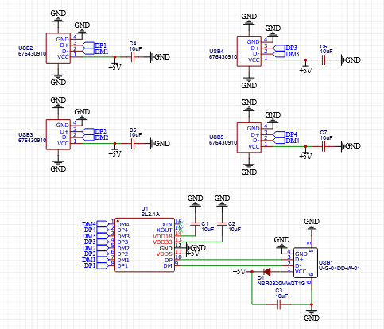
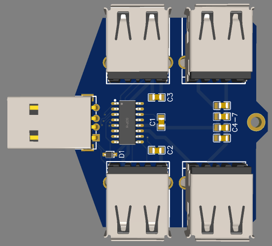
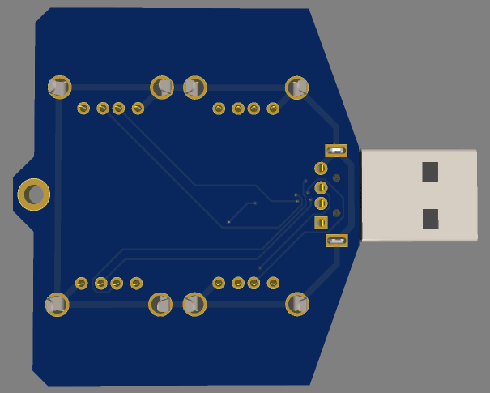

# usb-hub

# About
A 4 Port USB 2.0 Hub

# Images

Schematic (click to expand)

| Schematic |
|-----------|
|  |

| PCB | 3D Preview | Case |
|-----|------------|------|
|  |  | 
|  |  |  |

# BOM

# PCB: 1.5USD

 

